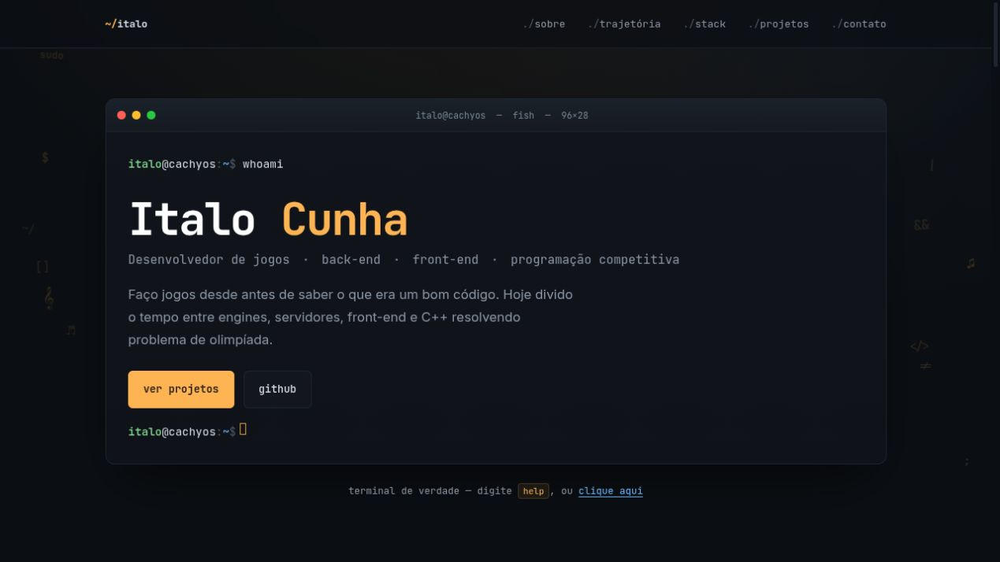
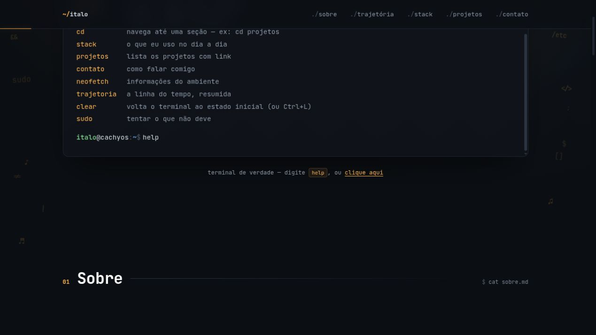
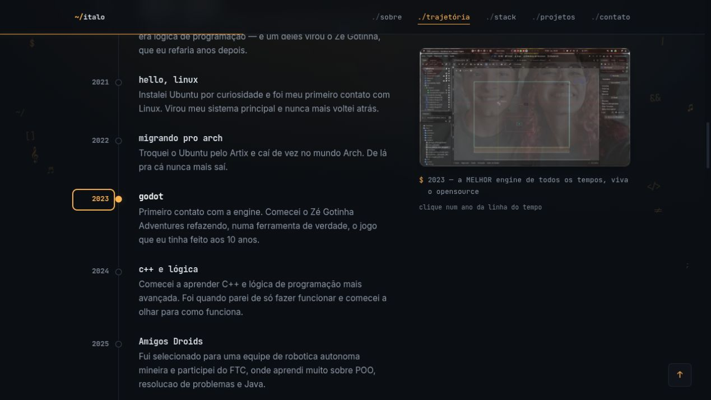
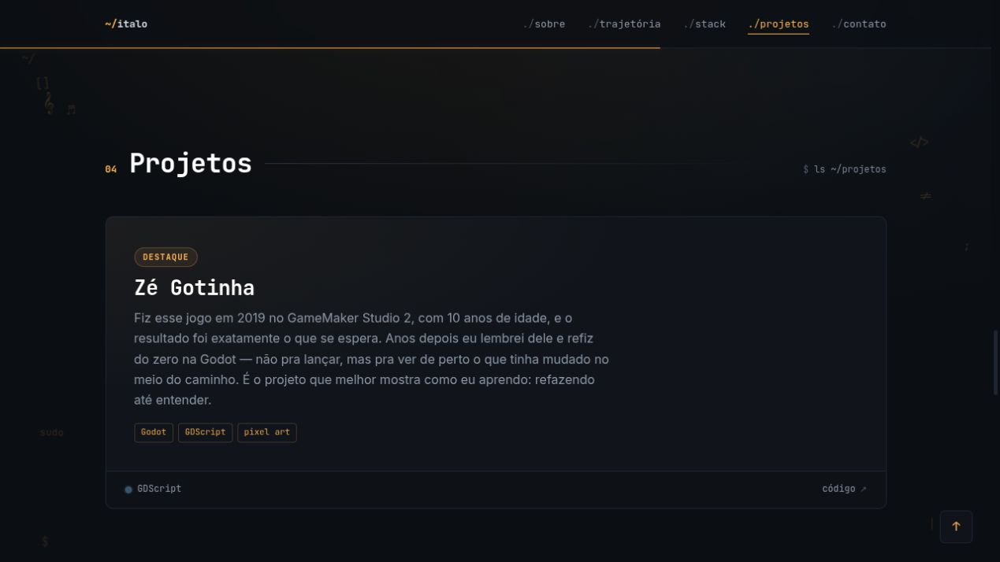
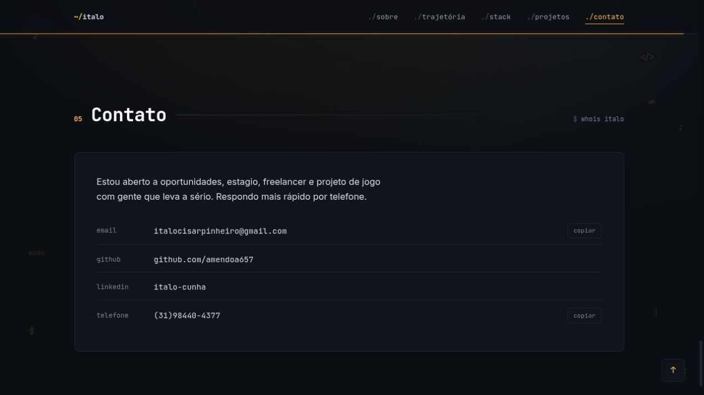

<div align="center">

# Portfólio — Italo Cunha

### Um portfólio pessoal com estética de terminal, trajetória visual e projetos reais.



<p>
  <a href="#a-ideia">A ideia</a> ·
  <a href="#telas">Telas</a> ·
  <a href="#interações">Interações</a> ·
  <a href="#rodando-localmente">Rodando localmente</a>
</p>

</div>

> Um site pessoal escrito à mão em **HTML, CSS e JavaScript**, sem framework, pensado para parecer um ambiente de trabalho — não um currículo jogado numa página.

🌐 **Versão publicada:** [portifolio.italocisarpinheiro.workers.dev](https://portifolio.italocisarpinheiro.workers.dev/)

## A ideia

O portfólio apresenta Italo Cunha como desenvolvedor de jogos, back-end, front-end e programação competitiva. A linguagem visual mistura terminal, neofetch, Git e uma interface escura de inspiração Linux:

- o herói começa como uma sessão de terminal;
- a trajetória funciona como um `git log --reverse` visual;
- a stack aparece como diretórios do sistema;
- os projetos são tratados como repositórios que merecem contexto;
- o contato termina como um `whois italo`.

## Telas

<table>
  <tr>
    <td width="50%">
      <strong>Hero + terminal</strong><br>
      <sub>Apresentação, links principais e um shell interativo no primeiro quadro.</sub><br><br>
      
    </td>
    <td width="50%">
      <strong>Terminal interativo</strong><br>
      <sub>Comandos como <code>help</code>, <code>ls</code>, <code>stack</code> e <code>cd projetos</code>.</sub><br><br>
      
    </td>
  </tr>
  <tr>
    <td>
      <strong>Trajetória</strong><br>
      <sub>Uma linha do tempo de 2019 até hoje com imagem e legenda por etapa.</sub><br><br>
      
    </td>
    <td>
      <strong>Projetos</strong><br>
      <sub>Projetos descritos pelo problema, pela tecnologia e pelo que ensinaram.</sub><br><br>
      
    </td>
  </tr>
  <tr>
    <td>
      <strong>Contato</strong><br>
      <sub>Links profissionais e botões para copiar e-mail e telefone.</sub><br><br>
      
    </td>
    <td valign="top">
      <strong>Direção visual</strong>
      <ul>
        <li>fundo quase preto e superfícies em camadas;</li>
        <li>JetBrains Mono para a linguagem de terminal;</li>
        <li>Inter para leitura longa;</li>
        <li>âmbar como acento padrão;</li>
        <li>símbolos flutuantes discretos nas margens;</li>
        <li>animações curtas e respeitosas com reduced motion.</li>
      </ul>
    </td>
  </tr>
</table>

## Interações

### Terminal

O terminal do herói possui histórico, autocompletar com `Tab`, histórico com as setas e comandos próprios:

| Comando | O que faz |
| --- | --- |
| `help` | Mostra os comandos disponíveis |
| `whoami` | Apresenta o desenvolvedor |
| `ls` | Lista as seções do site |
| `cd projetos` | Navega até uma seção |
| `stack` | Mostra as tecnologias do dia a dia |
| `projetos` | Lista os repositórios principais |
| `trajetoria` | Resume a linha do tempo |
| `neofetch` | Mostra o ambiente de trabalho |
| `clear` | Restaura o estado inicial do terminal |

### Trajetória visual

Cada ano é um botão acessível. Ao selecionar uma etapa, o painel lateral troca a imagem, atualiza a legenda e executa uma animação de varredura. Em telas menores, o painel é movido para perto do item selecionado.

### Tema e navegação

- A cor de acento pode ser trocada no bloco de ambiente, inspirado em um neofetch.
- A escolha fica salva no `localStorage` e volta no próximo acesso.
- A navegação marca a seção visível durante o scroll.
- A barra superior mostra o progresso de leitura.
- O menu mobile abre com botão hambúrguer, fecha ao navegar e responde a `Esc`.
- O conteúdo respeita `prefers-reduced-motion`.

## Estrutura

```text
.
├── index.html                 # Conteúdo e estrutura da página
├── style.css                  # Tokens, layout, responsividade e animações
├── img/                       # Imagens da trajetória e projetos
├── assetsReadme/              # Capturas usadas nesta documentação
└── js/
    ├── terminal.js            # Shell interativo do herói
    ├── trajetoriaImagens.js   # Timeline e painel de imagens
    ├── temaAcento.js          # Paleta persistente
    ├── navegacaoAtiva.js      # Seção ativa no menu
    ├── scrollRevelar.js       # Entrada dos blocos no scroll
    ├── progressoScroll.js     # Progresso de leitura
    ├── menuMobile.js          # Menu responsivo
    ├── copiarEmail.js         # Feedback dos botões de cópia
    ├── simbolosFlutuantes.js  # Glifos decorativos laterais
    ├── voltarTopo.js           # Atalho para o topo
    └── rodape.js               # Ano dinâmico do rodapé
```

## Projetos apresentados

- [Zé Gotinha](https://github.com/amendoa657/ZeGotinhaGame) — jogo na Godot e projeto de evolução pessoal.
- [Raycasting Game](https://github.com/amendoa657/RaycastingGame) — raycasting em Python/Pygame.
- [Site Grid](https://github.com/amendoa657/SiteGrid) — experiências com Grid, CSS e animações.
- [Criptografia por Matrizes](https://github.com/amendoa657/Criptografia) — C++ e álgebra linear.
- [CRUD com SQLAlchemy](https://github.com/amendoa657/sqlAlchemyCrud) — Flask, ORM e SQLite.
- [API REST em Laravel](https://github.com/amendoa657/laravelApiRest) — rotas, controllers, migrations e Eloquent.
- [Nerds Adventure](https://github.com/amendoa657/NerdsAdventure) — jogo em desenvolvimento na Godot.

## Rodando localmente

Como é um site estático, basta servir a pasta com qualquer servidor HTTP local:

```bash
git clone https://github.com/amendoa657/portifolio.git
cd portifolio
python3 -m http.server 8000
```

Depois, abra [`http://localhost:8000`](http://localhost:8000) no navegador.

Também é possível abrir o `index.html` diretamente, mas um servidor local é recomendado para testar o comportamento de todos os assets e scripts.

## Stack

| Camada | Tecnologia |
| --- | --- |
| Estrutura | HTML5 semântico |
| Estilo | CSS moderno, Grid, `color-mix`, responsividade |
| Interações | JavaScript vanilla |
| Tipografia | Inter + JetBrains Mono |
| Deploy | Qualquer hospedagem de site estático |

## Créditos e estado

Este portfólio é uma peça viva: a trajetória, os projetos e a paleta mudam conforme o ambiente e o trabalho mudam.

O repositório não possuía um README anterior; esta é a primeira documentação formal do projeto.
